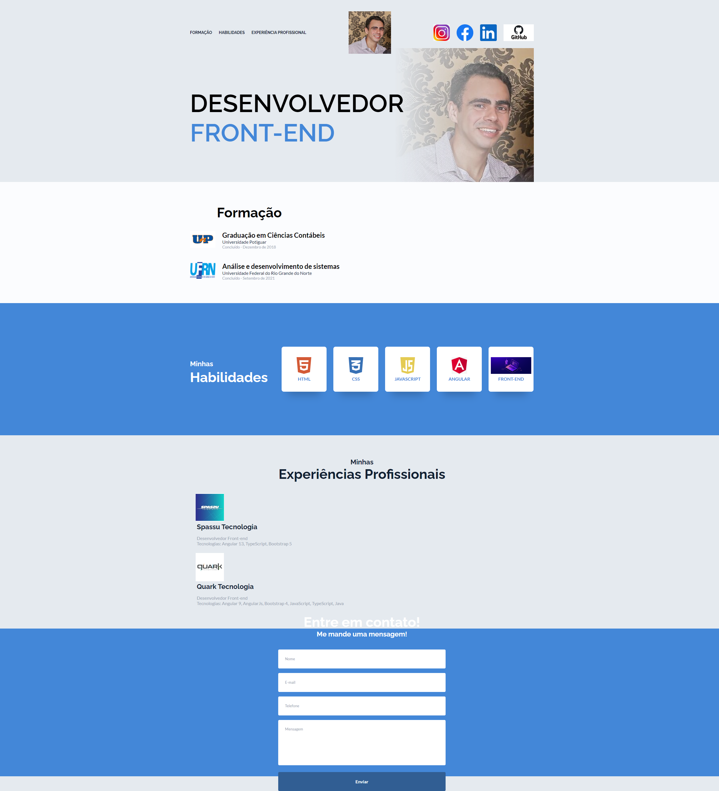

## Portfólio Francelino Marcílio

<h1 aling="center">
  Projeto de um Portfólio com HTML e CSS
</h1>

<h1>
  
</h1>

## Indice

- [Indice](#indice)
- [Sobre](#sobre)
- [Tecnologias utilizadas](#tecnologias-utilizadas)
- [Como baixar o projeto](#como-baixar-o-projeto)
- [Autor](#autor)
  
---

## Sobre 

O Projeto **Portfólio** foi desenvolvido com o que venho adquirindo de experiência e mostrar minhas habilidade, além de minhas formações Acadêmica.

---

## Tecnologias utilizadas 

O projeto foi desenvolvido utilizando as seguintes tecnologias
- HTML
- CSS

---

## Como baixar o projeto

```bash
# Clonar o repositório em sua máquina 
$ git clone https://github.com/francelinom/apresentacao-Portfolio

# Entrar na pasta do projeto 
$ cd apresentacao-Portfolio

```
---
## Autor

Desenvolvido por **Francelino Marcílio da Silva** 
<h1>
  
</h1>
